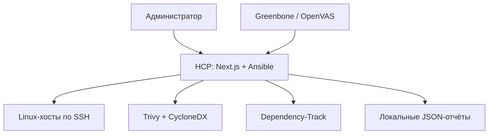

# Hardening Control Platform

Локальная веб-платформа для безагентного аудита и контролируемого харденинга Linux-хостов. Она устанавливается на один выделенный **control node** в вашей сети, подключается к серверам по SSH через Ansible и не устанавливает постоянных агентов на целевые ВМ.

Платформа предназначена только для активов, на проверку и изменение которых есть разрешение. Это не публичный сканер, SIEM или IDS.

Для схемы **Ubuntu → Astra Linux** начните с [единой инструкции установки, аудита и отката](docs/ubuntu-astra-setup.md). Команды резервирования самой платформы и восстановления на другой Ubuntu: [бэкап и восстановление](docs/backup-restore.md).

Отдельный контейнерный эксперимент: [инструкция стенда](deployment/lab/README.md). Фактически выполненные проверки и ограничения: [протокол проверки](docs/verification-report.md).

Для целевых машин **семейства Astra Linux** используйте [отдельную инструкцию](docs/astra-lab.md): она объясняет подготовку ВМ, проверку готовности в мастере и границы CVE/SCAP-поддержки. Автоматическое наследование поддержки Debian для Astra не применяется.

Для Astra доступны отдельный OVAL-аудит с локальной/сетевой базой и встроенный профиль HCP из 18 конфигурационных проверок. Назначение источников, запуск и границы покрытия: [инструкция OVAL и OpenSCAP для Astra](docs/astra-audit.md). Это не обещание полного охвата CVE или сертификационного соответствия.

До подключения Astra можно собрать один диагностический JSON без интернета и Ansible. На самой Astra из корня репозитория выполните:

```bash
sudo python3 ansible/scripts/hcp-host-readiness.py --include-oval-metadata > astra-readiness.json
```

Нужен Python 3.5+. Команда читает сведения ОС, готовность инструментов и метаданные локального `oval-db`; настройки не меняются. Если репозитория на ВМ ещё нет, достаточно перенести один файл скрипта, как описано в [инструкции](docs/astra-lab.md). Наличие файлов базы не считается подтверждением её подлинности, применимости или выполненного CVE-аудита.

## Короткая инструкция: запустить и обновлять HCP локально

Этим маршрутом пользуйтесь для рабочей платформы на своём control node. Все команды выполняются в **корне репозитория**. Скрипт `deployment/lab/up.sh` предназначен только для изолированного тестового стенда и для обычного запуска HCP не нужен.

Во всех примерах ниже используется команда `docker compose` с пробелом — это Docker Compose **v2.20+**. Если команда `docker compose version` выводит ошибку доступа к Docker daemon, добавляйте `sudo` перед каждой командой Docker, например `sudo docker compose ps`. Старый вариант `docker-compose` с дефисом (Compose v1) не подходит.

### Если платформа уже была запущена

Это обычный порядок обновления. Он пересобирает приложение, но сохраняет добавленные хосты, отчёты, SQLite и доверенные SSH-ключи в постоянном Docker volume.

1. Откройте терминал и перейдите в каталог проекта. Если вы клонировали его в другое место, замените путь на свой.

   ```bash
   cd ~/Desktop/hardening-control-platform
   git status --short
   ```

   Пустой вывод `git status --short` означает, что можно продолжать. Если появились файлы, не выполняйте `git pull` вслепую: сначала сохраните свои изменения или пришлите этот вывод для разбора.

2. Загрузите новую версию и дождитесь запуска контейнера.

   ```bash
   git pull --ff-only
   docker compose config --quiet
   docker compose up -d --build --wait --wait-timeout 180
   docker compose ps
   ```

   Успешный результат — сервис `hcp` в состоянии `running (healthy)`. Первые три минуты после обновления — нормальное время ожидания healthcheck.

3. Откройте в браузере на том же компьютере:

   ```text
   http://127.0.0.1:3000/login
   ```

   Войдите с паролем из `HCP_ADMIN_PASSWORD` в вашем файле `.env`.

**Не выполняйте при обычном обновлении** `cp .env.production.example .env`, `docker compose down -v`, `docker volume rm`, `git reset --hard` или `git clean -fd`. Эти команды могут перезаписать настройки либо удалить сохранённые данные. Обычная команда `docker compose down` безопасно останавливает платформу и не удаляет volume.

### Если HCP запускается на этом компьютере впервые

1. Проверьте, что установлены Git, Docker Engine и Compose v2:

   ```bash
   git --version
   docker --version
   docker compose version
   ```

   Нужен именно вывод `Docker Compose version v2.20` или новее. Если доступ к Docker запрещён, повторяйте Docker-команды через `sudo`.

2. Один раз скачайте проект и подготовьте локальные файлы. Эти команды нельзя повторять поверх уже работающей установки.

   ```bash
   git clone https://github.com/Danil-super/hardening-control-platform.git
   cd hardening-control-platform
   cp .env.production.example .env
   cp ansible/inventory.example.ini ansible/inventory.ini
   install -d -m 700 secrets
   install -m 600 /dev/null secrets/known_hosts
   chmod 600 .env
   ```

3. Откройте `.env` и задайте свои значения четырёх обязательных параметров:

   ```bash
   nano .env
   ```

   ```env
   HCP_ADMIN_PASSWORD=длинный-уникальный-пароль-для-входа
   HCP_AUTH_SECRET=случайная-строка-не-короче-32-символов
   HCP_AUDIT_HMAC_KEY=другая-случайная-строка-не-короче-32-символов
   HCP_SCHEDULE_API_KEY=третья-случайная-строка-не-короче-32-символов
   HCP_BIND_ADDRESS=127.0.0.1
   HCP_PORT=3000
   ```

   Для каждого ключа можно сгенерировать отдельную строку командой `openssl rand -base64 48`. Не отправляйте содержимое `.env`, `secrets/` и пароли в чат или репозиторий.

4. Проверьте конфигурацию, запустите контейнер и убедитесь, что он стал healthy:

   ```bash
   docker compose config --quiet
   docker compose up -d --build --wait --wait-timeout 180
   docker compose ps
   ```

   Затем откройте `http://127.0.0.1:3000/login` и войдите с `HCP_ADMIN_PASSWORD`.

### Если страница не открылась

Выполните эти безопасные диагностические команды из каталога проекта:

```bash
docker compose ps
docker compose logs --tail=200 hcp
curl -i http://127.0.0.1:3000/login
curl -i http://127.0.0.1:3000/api/ansible/session
```

Для `/login` ожидается `HTTP/1.1 200`. Для `/api/ansible/session` до входа нормален ответ `401`: он означает, что контейнер и сеть работают, а API запрашивает авторизацию. Не присылайте `.env`; для разбора достаточно вывода этих команд без паролей.

## Возможности

- SSH-мастер: отдельный ключ control node, независимая проверка SSH fingerprint, persistent `known_hosts`.
- Профили Ansible: базовый Linux, SSH, web-сервер, Docker-host.
- Инвентарь пакетов, CycloneDX SBOM и CVE-аудит Trivy с vendor-aware статусами пакетов.
- Учёт статуса поставщика пакета, исходного пакета/версии Debian и RPM epoch для корректного сопоставления дистрибутивных пакетов. Статус Trivy `fixed` означает наличие исправления и не делает найденную CVE безопасной для установленной версии.
- OpenSCAP/SSG для подготовленных хостов, временный Lynis, Nmap и `ssh-audit`.
- Импорт XML-отчёта Greenbone/OpenVAS и отправка SBOM в OWASP Dependency-Track.
- Единая сводка по хосту: показывает совпадающие CVE/сетевые признаки из разных источников, свежесть доказательств и не складывает CVSS в произвольный балл.
- План устранения: отдельная история решения, согласования заказчика, выполнения, принятого риска и подтверждения свежим повторным аудитом.
- Итоговый PDF: серверный снимок области, доказательств, решений и хешей источников без паролей и приватных ключей.
- Обратимые firewall-изменения: dry-run, причина, typed confirmation, backup и rollback.
- Безопасное завершение работ: отзыв уникального SSH-ключа HCP на целевом хосте до удаления локальной пары и inventory.
- SQLite с hash-chain журналом, история JSON-отчётов и systemd-расписание.

## Архитектура



## 1. Требования

Рекомендуемый вариант — отдельный компьютер или VM с **Ubuntu/Debian** в той же сети, что и проверяемые серверы.

| Компонент | Минимум | Рекомендация |
| --- | --- | --- |
| ОС control node | 64-bit Linux | Ubuntu 24.04 LTS / Debian 12 |
| CPU / RAM | 2 vCPU / 4 GB | 4 vCPU / 8 GB |
| Диск | 20 GB | 60+ GB, если запускается Dependency-Track |
| ПО | Git, Docker Engine, Docker Compose v2.20+, OpenSSH client | также VPN/бастион для изолированной сети |
| Сеть | SSH к управляемым хостам | HCP доступен только администраторам через LAN/VPN |

Ресурсы CPU/RAM в таблице относятся к HCP. При включении Dependency-Track выделите дополнительные ресурсы API и PostgreSQL: для API официально указаны минимум 2 ГБ RAM и рекомендация 8 ГБ. [Требования Dependency-Track](https://docs.dependencytrack.org/getting-started/deploy-docker/).

Windows и macOS подходят для локального тестового запуска через Docker Desktop. Для стенда с полноценными Linux-ВМ и systemd-планировщиком используйте Linux control node. Быстрая контейнерная проверка описана в [инструкции первого прогона](deployment/lab/README.md); контейнер не заменяет ВМ при проверке ядра, systemd и firewall.

Проверьте Docker:

```bash
docker --version
docker compose version
```

Если Docker ещё не установлен, поставьте Docker Engine и Compose по [официальной инструкции Ubuntu](https://docs.docker.com/engine/install/ubuntu/). Если пользователь не имеет доступа к Docker daemon, выполняйте все команды `docker` ниже через `sudo`; в [маршруте Ubuntu → Astra](docs/ubuntu-astra-setup.md) это уже учтено. На Ubuntu дополнительно потребуются Git и SSH-клиент:

```bash
sudo apt update
sudo apt install -y git openssh-client openssl curl
```

## 2. Установка на свой компьютер

### Клонирование и начальная структура

```bash
git clone https://github.com/Danil-super/hardening-control-platform.git
cd hardening-control-platform

cp .env.production.example .env
cp ansible/inventory.example.ini ansible/inventory.ini
mkdir -p secrets
chmod 700 secrets
```

Подготовьте начальный файл доверенных серверов. Индивидуальные SSH-ключи HCP создаст при подключении хостов через сайт.

```bash
install -m 600 /dev/null secrets/known_hosts
chmod 600 .env secrets/known_hosts
```

### Настройка `.env`

Приватные ключи каждого хоста создаются на управляющем сервере и сохраняются в постоянном томе. На целевую машину передаётся только её публичный ключ. Пароли первоначального SSH/sudo-подключения не сохраняются.

Откройте `.env` и замените все значения `replace-with-…` на уникальные секреты. Для каждого значения можно сгенерировать строку:

```bash
openssl rand -base64 48
```

Обязательные параметры:

```env
HCP_ADMIN_PASSWORD=длинный-уникальный-пароль-входа
HCP_AUTH_SECRET=случайная-строка-не-короче-32-символов
HCP_AUDIT_HMAC_KEY=отдельная-случайная-строка-не-короче-32-символов
HCP_SCHEDULE_API_KEY=ещё-один-отдельный-случайный-ключ-не-короче-32-символов
HCP_BIND_ADDRESS=127.0.0.1
HCP_PORT=3000
```

`HCP_BIND_ADDRESS=127.0.0.1` означает, что панель открывается только на самом control node. Для удалённого доступа используйте SSH-туннель, VPN или TLS reverse proxy, а не прямое открытие порта в интернет.

### Первый запуск

Проверьте конфигурацию и соберите контейнер:

```bash
docker compose config --quiet
docker compose up -d --build --wait --wait-timeout 180
docker compose ps
docker compose logs -f hcp
```

Откройте `http://127.0.0.1:3000` и войдите с `HCP_ADMIN_PASSWORD`. Экран «Обзор» покажет готовность control node и следующее действие; для добавления или аудита сервера откройте «Хосты».

Команда `config --quiet` проверяет конфигурацию без вывода паролей. При первом старте `ansible/inventory.ini` копируется в `/var/lib/hcp/inventory.ini` внутри постоянного volume. После этого рабочим inventory управляет панель; изменения начального файла в репозитории автоматически не импортируются. Это позволяет мастеру сохранять хосты независимо от UID владельца файлов на вашем компьютере.

Если панель запущена на удалённой VM, откройте туннель на своём компьютере:

```bash
ssh -L 3000:127.0.0.1:3000 user@control-node-ip
```

После этого используйте тот же адрес `http://127.0.0.1:3000` в браузере.

## 3. Подключение первого Linux-хоста

Следуйте [единой инструкции Ubuntu → Astra, раздел 4](docs/ubuntu-astra-setup.md#host-onboarding): **сканирование → выбор хоста → подтверждение сервера → вход по паролю → индивидуальная ключевая пара**. Для первого подключения возьмите отпечаток из доверенной консоли целевой Astra или реестра администратора и нажмите «Сверить и сохранить». HCP сам сравнит его с ключом той же Astra, полученным по сети. Собственный ключ Ubuntu в этой проверке не участвует; при следующих подключениях проверка сохранённого ключа выполняется автоматически. [Если машин много](docs/ubuntu-astra-setup.md#host-trust-fleet).

По кнопке «Подключить хост» HCP входит по паролю, затем создаёт отдельную пару, устанавливает публичный ключ и после проверки сохраняет хост. Терминал для входа или генерации этой пары не нужен. Пароль передаётся только после проверки ключа сервера.

Пароль вводится через HTTPS либо localhost (в том числе SSH-туннель), используется только в текущем запросе и не сохраняется. Последующие подключения используют индивидуальный ключ. Если ключ уже создан, но первый хост пользователя не root ещё не сохранён из-за прав администратора, повторите «Подключить хост» с паролем SSH или отдельным паролем sudo: HCP проверит `sudo` той же парой, без ротации ключа.

Подключайте хосты под root с разрешённым SSH-входом или под обычной учётной записью, которой разрешён `sudo` с паролем — то есть у которой работает `sudo su`. Во время первого подключения HCP использует этот пароль один раз для проверки прав, не создаёт правило в `sudoers.d` и не сохраняет пароль. Для каждого ручного аудита, изменения или отката такого хоста интерфейс запросит пароль sudo снова. Плановые задания без участия оператора требуют отдельной утверждённой организацией модели доступа (например, root по SSH или технический `sudo` без пароля); HCP не включает её автоматически. [Требования к доступу](docs/ubuntu-astra-setup.md#sudo-access). Для уже добавленного хоста [измените существующую запись](docs/ubuntu-astra-setup.md#existing-host), сохранив историю.

Уведомления исчезают через 3 секунды; при наведении или фокусе таймер приостанавливается. После входа открывается «Обзор» с готовностью control node, числом хостов и следующим действием. Для CVE Astra используется отдельный OVAL-аудит по базе производителя; результат Trivy не подтверждает полное покрытие Astra.

## 4. CVE, Trivy и vendor-aware оценка

Основной вариант в `.env` уже установлен:

```env
HCP_TRIVY_MODE=online
```

Trivy использует **одну общую базу CVE** для пакетов поддерживаемых Linux-систем, а не отдельную базу для каждого хоста или выпуска ОС. В нормальном сетевом режиме ничего заранее настраивать не требуется: перед первым CVE-аудитом HCP сам проверит этот cache и скачает его один раз, только если он отсутствует, устарел или дату нельзя подтвердить. Сам аудит затем использует зафиксированный снимок базы; целевой хост Astra не получает доступ в интернет.

В панели «Источники» можно посмотреть свежесть и при необходимости нажать «Обновить сейчас», но это не обязательный шаг запуска. На странице «Хосты» раскройте «Дополнительные проверки», выберите «Пакеты и CVE — Trivy» и запустите проверку. HCP сохранит инвентарь, сформирует CycloneDX SBOM, запустит Trivy и покажет установленную/фиксированную версию, статус поставщика и источник данных. Если автоматическое обновление не удастся, отчёт сохранит безопасную и конкретную причину; отсутствие CVE в частичном отчёте не считается доказательством безопасности.

Сохранённый в интерфейсе выбор имеет приоритет над `HCP_TRIVY_MODE`; переменная остаётся начальным значением для новой установки. **Локальная база** нужна только полностью изолированной сети и выбирается в «Источниках» → «Расширенная настройка для изолированной сети».

Если доступ к публичному интернету запрещён, но есть внутреннее OCI-зеркало, укажите его и оставьте сетевой режим: HCP будет обращаться только к внутренней сети.

```env
HCP_TRIVY_DB_REPOSITORY=registry.security.intra/trivy-db
```

Значение может содержать несколько OCI-адресов через запятую в порядке приоритета. Если переменная не задана, HCP использует официальные резервные источники Trivy: Google mirror, GHCR, AWS ECR и Docker Hub. Для текущего аудита пакетов ОС Java-база не требуется.

Для полностью изолированной сети сначала подготовьте актуальный cache Trivy в окно обновления, затем включите «Локальная база» в панели. В этом режиме HCP передаёт Trivy `--offline-scan --skip-db-update`: ни публичный registry, ни внутреннее зеркало не опрашиваются. Без актуальной локальной базы платформа создаст неполный отчёт `manual`, а не сообщит, что уязвимостей нет. Для Astra Trivy остаётся общим инвентарным контуром: vendor-CVE проверяйте отдельным OVAL-аудитом по базе именно своего выпуска и архитектуры.

## 5. OpenSCAP, Greenbone и Dependency-Track

### OpenSCAP / SSG

Для Astra в «Политиках» можно выбрать **«Astra Linux — базовые проверки HCP»**: 18 правил поставляются вместе с проектом и временно передаются на хост. Нужен OpenSCAP с SCE. Назначение базы для отдельного CVE-аудита описано в [инструкции Astra](docs/astra-audit.md). Примеры внешнего SSG ниже относятся к указанным в них ОС.

OpenSCAP запускается только на хостах, которые заранее подготовлены администратором. HCP не устанавливает scanner автоматически и не угадывает профиль.

Пример установки scanner и пакетного SCAP-content для Debian VM:

```bash
sudo apt update
sudo apt install -y openscap-scanner ssg-debian
dpkg -L ssg-debian | grep -- '-ds.xml$'
```

Пакет [ssg-debian](https://packages.debian.org/bookworm/ssg-debian) зависит от выпуска Debian; в нём может отсутствовать content для вашей ОС. Выберите файл, соответствующий точному выпуску хоста, и выполните `oscap info /полный/путь/к/datastream.xml`. Если подходящего файла нет, установите проверенный выпуск [ComplianceAsCode/content](https://github.com/ComplianceAsCode/content/releases) с поддержкой этой ОС. Не подставляйте datastream другого выпуска ради успешного запуска.

Для **целевой Ubuntu 24.04 VM** можно установить тот же официальный выпуск content, который прошёл отдельную проверку HCP в CI. Выполните на этой ВМ:

```bash
sudo apt update
sudo apt install -y openscap-scanner curl python3
export HCP_SSG_STAGE="$(mktemp -d)"
curl --fail --location --retry 2 \
  https://github.com/ComplianceAsCode/content/releases/download/v0.1.79/scap-security-guide-0.1.79.zip \
  --output "$HCP_SSG_STAGE/ssg.zip"
printf '%s  %s\n' \
  946718cf6f88e7a976d7e2b4f01ceaba6af9b18cace37d2c8bbffa8b205dd3e8 \
  "$HCP_SSG_STAGE/ssg.zip" | sha256sum --check --strict
```

Продолжайте только после результата `OK`:

```bash
python3 - <<'PY'
import os
from pathlib import Path, PurePosixPath
from zipfile import ZipFile
stage = Path(os.environ["HCP_SSG_STAGE"])
with ZipFile(stage / "ssg.zip") as archive:
    names = [name for name in archive.namelist() if PurePosixPath(name).name == "ssg-ubuntu2404-ds.xml"]
    assert len(names) == 1, "В архиве нет однозначного datastream Ubuntu 24.04"
    (stage / "ssg-ubuntu2404-ds.xml").write_bytes(archive.read(names[0]))
PY
sudo install -D -m 644 "$HCP_SSG_STAGE/ssg-ubuntu2404-ds.xml" \
  /usr/local/share/hcp/scap/0.1.79/ssg-ubuntu2404-ds.xml
oscap info /usr/local/share/hcp/scap/0.1.79/ssg-ubuntu2404-ds.xml
```

Используйте показанный `oscap info` профиль, соответствующий роли ВМ. Здесь устанавливается исходный официальный datastream; ограниченный профиль из шести правил создаётся только в CI. Для Debian и других выпусков Ubuntu нужен их собственный content. Первичное скачивание требует интернета; проверенный файл можно затем перенести на соответствующие ВМ изолированной сети.

В рабочем режиме откройте «Политики» и назначьте проверенный datastream и точный ID профиля из `oscap info` для отдельной inventory-группы, например `scap_hosts`. При запуске OpenSCAP HCP фиксирует профиль, checksum и mtime datastream в отчёте. Для конкретного правила можно добавить временное согласованное исключение с причиной и датой окончания: оно показывается рядом с находкой, сохраняя исходный результат проверки и риск. Исключение не означает, что нарушение исправлено.

Переменные `.env` остаются fallback для групп без записи в «Политиках» и прямого запуска playbook. Планировщик обращается к внутреннему API и применяет настройки и исключения из панели отдельно для каждого хоста:

```env
HCP_OPENSCAP_DATASTREAM=/usr/share/xml/scap/ssg/content/ssg-debian12-ds.xml
HCP_OPENSCAP_PROFILE=xccdf_org.ssgproject.content_profile_cis_server_l1
```

```bash
docker compose up -d
```

Не применяйте один CIS/STIG-профиль к неподходящим ролям. Если один хост входит в две группы с разными OpenSCAP-профилями, HCP остановит запуск и попросит устранить неоднозначность.

Путь и профиль выше — пример, допустимый только если оба присутствуют на вашей ВМ. Наличие `/usr/bin/oscap` в контейнере control node не означает, что он установлен на проверяемом хосте.

### Greenbone / OpenVAS

Разверните Greenbone отдельной VM/сервисом по официальной документации и не передавайте ему SSH-ключ HCP. Ограничьте цели сканирования разрешёнными подсетями, настройте обновление VT-feeds, затем экспортируйте завершённый report в XML. В HCP выберите хост → «Импорт сетевого отчёта Greenbone / OpenVAS» → загрузите XML.

Исходный XML удаляется после обработки; HCP сохраняет нормализованные OID, CVE, порт, severity, доказательство и рекомендацию.

### OWASP Dependency-Track

Заполните `HCP_DEPENDENCY_TRACK_DB_PASSWORD` в `.env`, затем включите отдельный профиль:

```bash
docker compose --profile dependency-track up -d --build
```

Интерфейс будет на `http://127.0.0.1:8080`, API — на `http://127.0.0.1:8081`. Первый вход: `admin` / `admin`, затем обязательная смена пароля. Дождитесь завершения первоначального заполнения источников в логах API: оно может занять 10–30 минут и дольше. Это поведение описано в [инструкции Dependency-Track](https://docs.dependencytrack.org/getting-started/initial-startup/).

```bash
docker compose --profile dependency-track ps
curl --fail http://127.0.0.1:8081/health/ready
docker compose --profile dependency-track logs --tail=100 dependency-track-api
```

Ответ readiness должен содержать `status: UP` и успешную проверку БД. Это проверяет доступность API/PostgreSQL, но не завершение наполнения CVE-источников. [Описание health API](https://docs.dependencytrack.org/getting-started/monitoring/).

Перед первым анализом настройте в Dependency-Track NVD REST API и внутренний анализатор, отключите OSV и дождитесь завершения загрузки NVD. GHSA подключайте только при наличии отдельного токена. Выполните [проверку CVE-источников](docs/audit-integrations.md#проверка-cve-источников-dependency-track): там описаны проверка настроек без изменения сервера, признаки завершённой синхронизации и контроль уязвимой/исправленной версии. Успешная загрузка SBOM сама по себе не подтверждает, что CVE-анализ выполнен.

Создайте отдельную команду с разрешениями `BOM_UPLOAD` и `PROJECT_CREATION_UPLOAD` (HCP создаёт проект при первой загрузке), получите её API key и добавьте в `.env`:

```env
HCP_DEPENDENCY_TRACK_URL=http://dependency-track-api:8080
HCP_DEPENDENCY_TRACK_API_KEY=ключ-с-правом-загрузки-bom
```

Выполните `docker compose --profile dependency-track up -d hcp`. Следующий Trivy-аудит отправит SBOM в проект с именем inventory alias. HCP сохраняет подтверждение приёма SBOM; результаты асинхронного CVE-анализа следует смотреть в самом Dependency-Track. Они пока не импортируются обратно в сводку HCP.

При доступе по SSH-туннелю пробросьте оба порта: `ssh -L 8080:127.0.0.1:8080 -L 8081:127.0.0.1:8081 user@control-node-ip`. `HCP_DEPENDENCY_TRACK_PUBLIC_API_URL` должен быть доступен именно браузеру и соответствовать внешнему адресу API; внутреннее имя `dependency-track-api` подходит только для HCP.

Образы Dependency-Track закреплены на `4.14.3`, под конфигурацию `ALPINE_*` ветки 4.x. Не заменяйте тег на `latest` без проверки миграций. В production дополнительно закрепите проверенные digest. Данные PostgreSQL и каталог `/data` API сохраняются отдельно: в `/data` находится ключ шифрования секретов, поэтому резервировать только PostgreSQL недостаточно. [Документация конфигурации](https://docs.dependencytrack.org/getting-started/configuration/).

## 6. Единый отчёт по хосту

В «Отчётах» нажмите «Сводка» для хоста. Она объединяет только совпадающие технические признаки из последних отчётов:

- одинаковый CVE из Trivy и Greenbone;
- одинаковый сетевой порт;
- идентификатор OpenSCAP-правила или OID Greenbone.

Сводка показывает источник, ссылку на исходный отчёт, доказательство и статус уверенности:

- **подтверждено** — совпало минимум в двух независимых источниках;
- **один источник** — нужна проверка в контексте роли сервера;
- **ручная оценка** — источник сообщил неполный или неоднозначный результат.

Отчёты старше `HCP_CORRELATION_MAX_AGE_HOURS` (по умолчанию 168 часов) не участвуют в сводке и помечаются как устаревшие.

## 7. Регулярный аудит

Есть два независимых systemd timer.

- `hcp-scheduled-audit.timer` — обычный Ansible-аудит каждые 15 минут.
- `hcp-deep-audit.timer` — ежедневная проверка пакетов + Trivy в 02:30; при настроенном ключе также передаёт SBOM в Dependency-Track.

Установите units:

```bash
sudo cp deployment/systemd/hcp-scheduled-audit.service /etc/systemd/system/
sudo cp deployment/systemd/hcp-scheduled-audit.timer /etc/systemd/system/
sudo cp deployment/systemd/hcp-deep-audit.service /etc/systemd/system/
sudo cp deployment/systemd/hcp-deep-audit.timer /etc/systemd/system/
sudo systemctl edit hcp-scheduled-audit.service
sudo systemctl edit hcp-deep-audit.service
```

В каждом из двух редакторов укажите абсолютный путь к клонированному репозиторию на вашем компьютере (его показывает `pwd` в корне проекта):

```ini
[Service]
WorkingDirectory=/абсолютный/путь/hardening-control-platform
```

В комплектных units по умолчанию указан `/opt/hardening-control-platform`. Проверьте также, что `command -v docker` возвращает `/usr/bin/docker`, либо исправьте `ExecStart` в unit. Затем:

```bash
sudo systemctl daemon-reload
sudo systemctl start hcp-scheduled-audit.service
sudo systemctl start hcp-deep-audit.service
sudo systemctl enable --now hcp-scheduled-audit.timer hcp-deep-audit.timer
systemctl list-timers 'hcp-*audit.timer'
```

Для OpenSCAP в ежедневной глубокой проверке сначала подготовьте отдельную группу `scap_hosts` и профиль в «Политиках» (либо fallback `HCP_OPENSCAP_*`), задайте в `.env` `HCP_SCHEDULE_DEEP_LIMIT=scap_hosts`, выполните `docker compose up -d`, затем создайте override:

```bash
sudo systemctl edit hcp-deep-audit.service
```

В открывшийся файл добавьте:

```ini
[Service]
Environment=HCP_DEEP_SCHEDULE_TASKS=packages,openscap
```

После этого:

```bash
sudo systemctl daemon-reload
sudo systemctl restart hcp-deep-audit.timer
```

Логи плановых запусков:

```bash
journalctl -u hcp-scheduled-audit.service -n 100 --no-pager
journalctl -u hcp-deep-audit.service -n 100 --no-pager
```

## 8. Резервное копирование, обновление и остановка

Полные команды остановки, сохранения runtime/секретов/образа и восстановления на отдельной Ubuntu приведены в [инструкции бэкапа и восстановления](docs/backup-restore.md). Автоматические firewall-архивы находятся на Astra и содержат только `/etc/ufw` либо `/etc/firewalld`; это не копия всей ОС и не бэкап данных HCP.

Регулярно сохраняйте вне control node:

- рабочий inventory `/var/lib/hcp/inventory.ini` из volume;
- `.env` и `secrets/` в защищённом хранилище;
- Docker volume `hcp-runtime` (SQLite, отчёты, SBOM, trusted host keys);
- volume Dependency-Track PostgreSQL и `dependency-track-data`, если профиль включён.

Получить актуальный inventory (команду выполняют в корне репозитория):

```bash
umask 077
docker compose exec --user node -T hcp cat /var/lib/hcp/inventory.ini > secrets/inventory-backup.ini
```

Для согласованной резервной копии SQLite остановите плановые задания и HCP перед копированием всего `hcp-runtime`; не копируйте только файл `.sqlite` во время записи. Сохранение volume также сохраняет WAL/SHM, отчёты, SBOM и `known_hosts`.

Перед обновлением выполните краткий порядок из раздела [«Если платформа уже была запущена»](#если-платформа-уже-была-запущена). Для удобства он повторён здесь:

```bash
cd ~/Desktop/hardening-control-platform
git status --short
git pull --ff-only
docker compose config --quiet
docker compose up -d --build --wait --wait-timeout 180
docker compose ps
```

Продолжайте только при пустом выводе `git status --short`. Команда `git pull --ff-only` не перезаписывает локальные коммиты: если она остановилась, сначала разберите расхождение веток, а не используйте принудительный reset. После обновления откройте `http://127.0.0.1:3000/login`.

Если включён Dependency-Track:

```bash
docker compose --profile dependency-track up -d --build --wait --wait-timeout 180
```

Остановить сервисы, сохранив данные:

```bash
docker compose down
```

Не добавляйте `-v`, если не хотите удалить все сохранённые отчёты и базу.

## 9. Быстрая диагностика

```bash
docker compose ps
docker compose logs --tail=200 hcp
docker compose exec --user node hcp ansible-playbook --version
docker compose exec --user node hcp trivy --version
docker compose exec --user node hcp /usr/local/bin/hcp-scheduled-audit
```

Если CVE-отчёт `manual`, сначала проверьте доступность/свежесть базы Trivy и точность PURL в SBOM. Если OpenSCAP `manual`, проверьте наличие `oscap`, datastream и profile на самом целевом хосте. Если Greenbone-импорт пустой, проверьте, что экспортирован завершённый **report XML**, а не конфигурация задачи.

## Дополнительная документация

- [Интеграции аудита](docs/audit-integrations.md)
- [Архитектура](docs/architecture.md)
- [Инструкция интерфейса](docs/site-guide.md)
- [Развёртывание](deployment/README.md)
- [Ubuntu → Astra: единый порядок действий](docs/ubuntu-astra-setup.md)
- [Бэкап HCP и восстановление на другой Ubuntu](docs/backup-restore.md)
- [Завершение проекта и безопасный отзыв доступа](docs/project-closeout.md)
- [Первый тестовый прогон: контейнер и полноценные ВМ](deployment/lab/README.md)
- [Описание дипломного проекта](docs/diploma-description.md)
