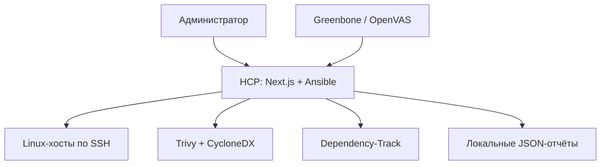

# Hardening Control Platform

Локальная веб-платформа для безагентного аудита и контролируемого харденинга Linux-хостов. Она устанавливается на один выделенный **control node** в вашей сети, подключается к серверам по SSH через Ansible и не устанавливает постоянных агентов на целевые ВМ.

Платформа предназначена только для активов, на проверку и изменение которых есть разрешение. Это не публичный сканер, SIEM или IDS.

## Что уже работает

- SSH-мастер: отдельный ключ control node, независимая проверка SSH fingerprint, persistent `known_hosts`.
- Профили Ansible: базовый Linux, SSH, web-сервер, Docker-host.
- Инвентарь пакетов, CycloneDX SBOM и CVE-аудит Trivy с vendor-aware статусами пакетов.
- Учет статуса поставщика пакета (`affected`, `not affected`, `fixed`, `will not fix`, `end of life`) и RPM epoch, чтобы не путать upstream-CVE с дистрибутивным backport-исправлением.
- OpenSCAP/SSG для подготовленных хостов, временный Lynis, Nmap и `ssh-audit`.
- Импорт XML-отчёта Greenbone/OpenVAS и отправка SBOM в OWASP Dependency-Track.
- Единая сводка по хосту: показывает совпадающие CVE/сетевые признаки из независимых источников, свежесть доказательств и не складывает CVSS в произвольный балл.
- Обратимые firewall-изменения: dry-run, причина, typed confirmation, backup и rollback.
- SQLite с hash-chain журналом, история JSON-отчётов и systemd-расписание.

## Архитектура



## 1. Требования

Рекомендуемый вариант — отдельный компьютер или VM с **Ubuntu/Debian** в той же сети, что и проверяемые серверы.

| Компонент | Минимум | Рекомендация |
| --- | --- | --- |
| ОС control node | 64-bit Linux | Ubuntu 24.04 LTS / Debian 12 |
| CPU / RAM | 2 vCPU / 4 GB | 4 vCPU / 8 GB |
| Диск | 20 GB | 60+ GB, если запускается Dependency-Track |
| ПО | Git, Docker Engine, Docker Compose v2, OpenSSH client | также VPN/бастион для изолированной сети |
| Сеть | SSH к управляемым хостам | HCP доступен только администраторам через LAN/VPN |

Windows и macOS подходят для локального демо через Docker Desktop, но для постоянного аудита хостов в LAN используйте Linux control node. Systemd-планировщик работает именно на Linux.

Проверьте Docker:

```bash
docker --version
docker compose version
```

Если Docker ещё не установлен, поставьте Docker Engine и Compose v2 по инструкции для вашей ОС. На Ubuntu дополнительно потребуются Git и SSH-клиент:

```bash
sudo apt update
sudo apt install -y git openssh-client
```

## 2. Установка на свой компьютер

### Клонирование и начальная структура

```bash
git clone https://github.com/Danil-super/hardening-control-platform.git
cd hardening-control-platform

cp .env.production.example .env
cp ansible/inventory.example.ini ansible/inventory.ini
mkdir -p secrets
```

Создайте отдельный SSH-ключ платформы. Не используйте личный ключ администратора.

```bash
ssh-keygen -t ed25519 -f secrets/hcp-control -C hcp-control
install -m 600 /dev/null secrets/known_hosts
```

### Настройка `.env`

Откройте `.env` и замените все значения `replace-with-…` на уникальные секреты. Для каждого значения можно сгенерировать строку:

```bash
openssl rand -base64 48
```

Обязательные параметры:

```env
HCP_ADMIN_PASSWORD=длинный-уникальный-пароль-входа
HCP_AUTH_SECRET=случайная-строка-не-короче-32-символов
HCP_AUDIT_HMAC_KEY=отдельная-случайная-строка-не-короче-32-символов
HCP_SCHEDULE_API_KEY=ещё-один-отдельный-случайный-ключ-не-короче-32-символов
HCP_BIND_ADDRESS=127.0.0.1
HCP_PORT=3000
```

`HCP_BIND_ADDRESS=127.0.0.1` означает, что панель открывается только на самом control node. Для удалённого доступа используйте SSH-туннель, VPN или TLS reverse proxy, а не прямое открытие порта в интернет.

### Первый запуск

Проверьте конфигурацию и соберите контейнер:

```bash
docker compose config
docker compose up -d --build
docker compose ps
docker compose logs -f hcp
```

Откройте `http://127.0.0.1:3000`, войдите с `HCP_ADMIN_PASSWORD` и перейдите в «Хосты».

Если панель запущена на удалённой VM, откройте туннель на своём компьютере:

```bash
ssh -L 3000:127.0.0.1:3000 user@control-node-ip
```

После этого используйте тот же адрес `http://127.0.0.1:3000` в браузере.

## 3. Подключение первого Linux-хоста

1. В панели откройте «Хосты» → «Мастер первого SSH-подключения».
2. Скопируйте публичный ключ control node и добавьте его на целевую VM через её консоль, временный утверждённый доступ или систему управления конфигурацией.
3. Сверьте fingerprint SSH-сервера **по независимому каналу**: консоль гипервизора, панель провайдера или утверждённый реестр ключей.
4. Вставьте подтверждённый fingerprint в мастер, выполните preflight и только затем сохраните хост в inventory.
5. Выберите профиль и запустите базовый аудит.

Пароль SSH в HCP не вводится и не сохраняется. Не используйте `ssh-keyscan` как единственный способ доверия ключу: он не защищает от атаки «человек посередине».

## 4. CVE, Trivy и vendor-aware оценка

Основной вариант в `.env` уже установлен:

```env
HCP_TRIVY_MODE=online
```

После «Проверить пакеты и CVE» HCP сохраняет инвентарь, формирует CycloneDX SBOM, запускает Trivy и показывает установленную/фиксированную версию, статус поставщика и источник данных. В панели «Источники» можно переключить источник CVE-данных:

- **Сетевая база** — Trivy обновляет данные через публичный registry или заданное внутреннее OCI-зеркало.
- **Локальная база** — Trivy запускается без доступа к сети и использует только заранее подготовленный cache в persistent volume.

Сохранённый в интерфейсе выбор имеет приоритет над `HCP_TRIVY_MODE`; переменная остаётся начальным значением для новой установки.

Если доступ к публичному интернету запрещён, но есть внутреннее OCI-зеркало, укажите его и оставьте сетевой режим: HCP будет обращаться только к внутренней сети.

```env
HCP_TRIVY_DB_REPOSITORY=registry.security.intra/trivy-db
HCP_TRIVY_JAVA_DB_REPOSITORY=registry.security.intra/trivy-java-db
```

Для полностью изолированной сети сначала подготовьте актуальный cache Trivy в окно обновления, затем включите «Локальная база» в панели. В этом режиме HCP передаёт Trivy `--offline-scan --skip-db-update`: ни публичный registry, ни внутреннее зеркало не опрашиваются. Без актуальной локальной базы платформа создаст неполный отчёт `manual`, а не сообщит, что уязвимостей нет. Для Debian/RHEL всегда проверяйте advisory поставщика перед исправлением: backport может устранять CVE без видимой смены upstream-версии.

## 5. OpenSCAP, Greenbone и Dependency-Track

### OpenSCAP / SSG

OpenSCAP запускается только на хостах, которые заранее подготовлены администратором. HCP не устанавливает scanner автоматически и не угадывает профиль.

Пример для Debian-подобной VM:

```bash
sudo apt update
sudo apt install openscap-scanner ssg-debderived
oscap info /usr/share/xml/scap/ssg/content/ssg-debian12-ds.xml
```

Укажите проверенный datastream и точный профиль в `.env`, затем перезапустите HCP:

```env
HCP_OPENSCAP_DATASTREAM=/usr/share/xml/scap/ssg/content/ssg-debian12-ds.xml
HCP_OPENSCAP_PROFILE=xccdf_org.ssgproject.content_profile_cis_server_l1
```

```bash
docker compose up -d
```

Для OpenSCAP создайте отдельную inventory-группу, например `scap_hosts`, чтобы не применять один CIS/STIG-профиль к неподходящим ролям.

### Greenbone / OpenVAS

Разверните Greenbone отдельной VM/сервисом по официальной документации и не передавайте ему SSH-ключ HCP. Ограничьте цели сканирования разрешёнными подсетями, настройте обновление VT-feeds, затем экспортируйте завершённый report в XML. В HCP выберите хост → «Импорт сетевого отчёта Greenbone / OpenVAS» → загрузите XML.

Исходный XML удаляется после обработки; HCP сохраняет нормализованные OID, CVE, порт, severity, доказательство и рекомендацию.

### OWASP Dependency-Track

Заполните `HCP_DEPENDENCY_TRACK_DB_PASSWORD` в `.env`, затем включите отдельный профиль:

```bash
docker compose --profile dependency-track up -d --build
```

Интерфейс будет на `http://127.0.0.1:8080`. После начальной безопасной настройки создайте API key с правом загружать BOM и добавьте в `.env`:

```env
HCP_DEPENDENCY_TRACK_URL=http://dependency-track-api:8080
HCP_DEPENDENCY_TRACK_API_KEY=ключ-с-правом-загрузки-bom
```

Перезапустите HCP. Следующий Trivy-аудит отправит SBOM в проект с именем inventory alias. Dependency-Track обрабатывает BOM асинхронно: его verdict не подменяет Trivy, а служит независимым источником.

Перед production закрепите внешние Docker-образы проверенными digest вместо mutable `latest`.

## 6. Единый отчёт по хосту

В «Отчётах» нажмите «Сводка» для хоста. Она объединяет только совпадающие технические признаки из последних отчётов:

- одинаковый CVE из Trivy и Greenbone;
- одинаковый сетевой порт;
- идентификатор OpenSCAP-правила или OID Greenbone.

Сводка показывает источник, ссылку на исходный отчёт, доказательство и статус уверенности:

- **подтверждено** — совпало минимум в двух независимых источниках;
- **один источник** — нужна проверка в контексте роли сервера;
- **ручная оценка** — источник сообщил неполный или неоднозначный результат.

Отчёты старше `HCP_CORRELATION_MAX_AGE_HOURS` (по умолчанию 168 часов) не участвуют в сводке и помечаются как устаревшие.

## 7. Регулярный аудит

Есть два независимых systemd timer.

- `hcp-scheduled-audit.timer` — обычный Ansible-аудит каждые 15 минут.
- `hcp-deep-audit.timer` — ежедневная проверка пакетов + Trivy в 02:30; при настроенном ключе также передаёт SBOM в Dependency-Track.

Установите units:

```bash
sudo cp deployment/systemd/hcp-scheduled-audit.service /etc/systemd/system/
sudo cp deployment/systemd/hcp-scheduled-audit.timer /etc/systemd/system/
sudo cp deployment/systemd/hcp-deep-audit.service /etc/systemd/system/
sudo cp deployment/systemd/hcp-deep-audit.timer /etc/systemd/system/
sudo systemctl daemon-reload
sudo systemctl enable --now hcp-scheduled-audit.timer hcp-deep-audit.timer
systemctl list-timers 'hcp-*audit.timer'
```

Для OpenSCAP в ежедневной глубокой проверке сначала настройте `HCP_OPENSCAP_*` и отдельную группу `scap_hosts`, задайте в `.env` `HCP_SCHEDULE_DEEP_LIMIT=scap_hosts`, выполните `docker compose up -d`, затем создайте override:

```bash
sudo systemctl edit hcp-deep-audit.service
```

В открывшийся файл добавьте:

```ini
[Service]
Environment=HCP_DEEP_SCHEDULE_TASKS=packages,openscap
```

После этого:

```bash
sudo systemctl daemon-reload
sudo systemctl restart hcp-deep-audit.timer
```

Логи плановых запусков:

```bash
journalctl -u hcp-scheduled-audit.service -n 100 --no-pager
journalctl -u hcp-deep-audit.service -n 100 --no-pager
```

## 8. Резервное копирование, обновление и остановка

Регулярно сохраняйте вне control node:

- `ansible/inventory.ini`;
- `.env` и `secrets/` в защищённом хранилище;
- Docker volume `hcp-runtime` (SQLite, отчёты, SBOM, trusted host keys);
- volume Dependency-Track PostgreSQL, если профиль включён.

Для обновления:

```bash
git pull --ff-only
docker compose up -d --build
```

Если включён Dependency-Track:

```bash
docker compose --profile dependency-track up -d --build
```

Остановить сервисы, сохранив данные:

```bash
docker compose down
```

Не добавляйте `-v`, если не хотите удалить все сохранённые отчёты и базу.

## 9. Быстрая диагностика

```bash
docker compose ps
docker compose logs --tail=200 hcp
docker compose exec hcp ansible-playbook --version
docker compose exec hcp trivy --version
docker compose exec hcp /usr/local/bin/hcp-scheduled-audit
```

Если CVE-отчёт `manual`, сначала проверьте доступность/свежесть базы Trivy и точность PURL в SBOM. Если OpenSCAP `manual`, проверьте наличие `oscap`, datastream и profile на самом целевом хосте. Если Greenbone-импорт пустой, проверьте, что экспортирован завершённый **report XML**, а не конфигурация задачи.

## Дополнительная документация

- [Интеграции аудита](docs/audit-integrations.md)
- [Архитектура](docs/architecture.md)
- [Инструкция интерфейса](docs/site-guide.md)
- [Развёртывание](deployment/README.md)
- [Описание дипломного проекта](docs/diploma-description.md)
