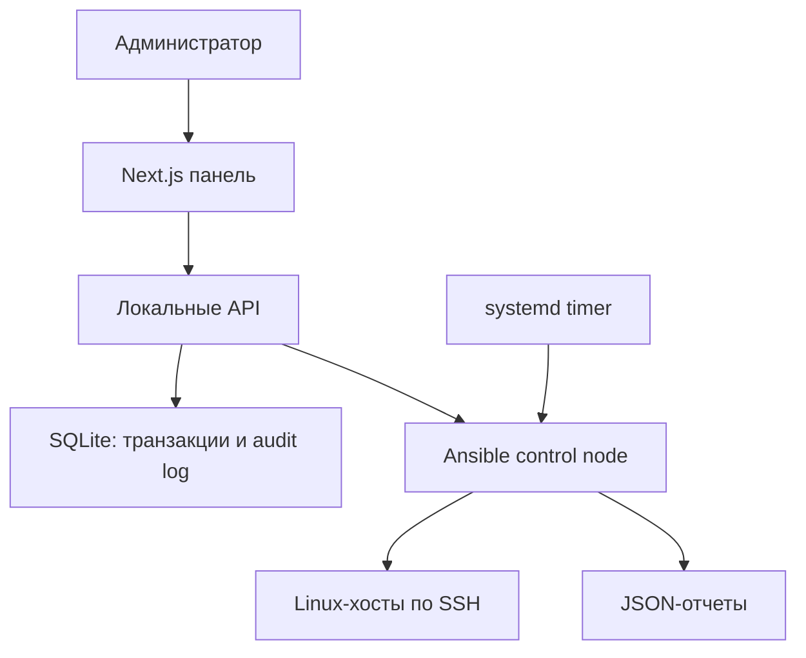

# Архитектура

## Компоненты

- **Next.js-панель** управляет inventory, запускает проверки, показывает отчеты и историю изменений. Она не предназначена для Vercel или публичного доступа.
- **Ansible control node** запускает playbook'и только из встроенного allowlist. Подключение выполняется SSH-ключом с pinned `known_hosts`.
- **Профили аудита** лежат в `ansible/audit-rules/` как версионированные YAML-файлы. `agentless-audit.yml` загружает именно выбранный профиль и выполняет соответствующие SSH, web- или Docker-проверки на целевой ВМ.
- **SQLite** (`HCP_STATE_DIR/hcp.sqlite`) хранит транзакции remediation и append-only журнал. У каждой записи есть HMAC предыдущей записи; `/api/ansible/incidents` проверяет целостность цепочки.
- **JSON-отчеты** остаются отдельными артефактами аудита в `HCP_REPORTS_DIR`; база хранит ссылки на отчеты до и после изменения.
- **systemd timer** запускает отдельный CLI-аудит с `flock`, исключая параллельные запуски и зависимость от памяти веб-процесса.

## Транзакция remediation

1. Панель принимает только один известный alias, причину изменения и повторный ввод alias.
2. `--check --diff` показывает dry-run без изменения хоста.
3. При применении выполняется audit «до», затем `backup-remediation.yml` сохраняет UFW/firewalld-конфигурацию на целевом хосте.
4. Выполняется обратимое firewall-действие.
5. Запускается audit «после»; обе ссылки сохраняются в SQLite.
6. `rollback-remediation.yml` восстанавливает архив и перезагружает firewall.

К расширяемым, но намеренно не автоматизированным в этой версии операциям относятся обновление пакетов и управление сервисами: универсальный автоматический откат этих действий ненадежен.
